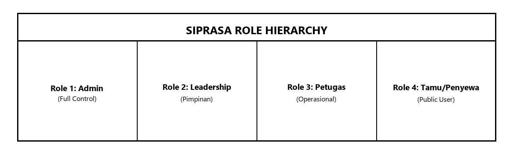
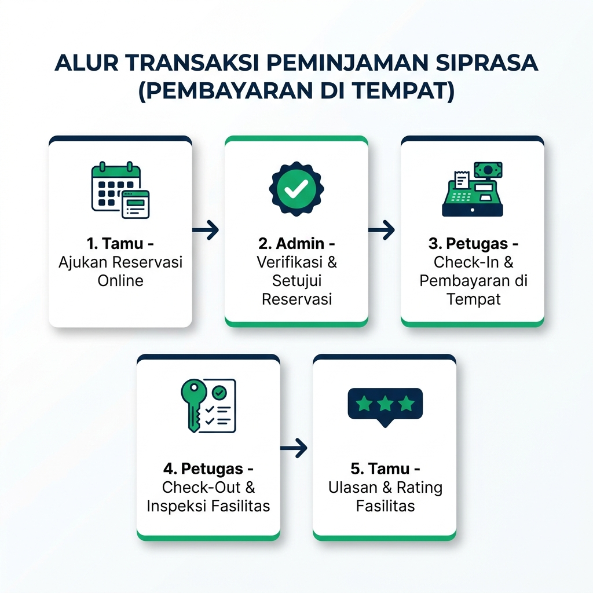

# BUKU PANDUAN PENGGUNAAN (MANUAL BOOK)
## SISTEM INFORMASI PEMINJAMAN SARANA DAN PRASARANA (SIPRASA) ASRAMA HAJI KELAS I BANJARMASIN

---

> **Catatan Dokumen:**
> Dokumen ini disusun sebagai Lampiran Buku Tugas Akhir (TA) untuk memberikan panduan operasional lengkap bagi seluruh pemangku kepentingan (*stakeholder*) dan pengguna sistem informasi SIPRASA. Dokumen ini terdiri dari 3 bab utama: **Bab 1 Pendahuluan**, **Bab 2 Panduan Penggunaan (User Manual)**, dan **Bab 3 Pemecahan Masalah (Troubleshooting)**.

---

## DAFTAR ISI

- [BAB 1: PENDAHULUAN](#bab-1-pendahuluan)
  - [1.1 Tujuan Manual Book](#11-tujuan-manual-book)
  - [1.2 Sistem Minimum (Spesifikasi Teknis)](#12-sistem-minimum-spesifikasi-teknis)
  - [1.3 Daftar Hak Akses (Role Matrix)](#13-daftar-hak-akses-role-matrix)
- [BAB 2: PANDUAN PENGGUNAAN (USER MANUAL)](#bab-2-panduan-penggunaan-user-manual)
  - [2.1 Awal Mula (Akses & Autentikasi)](#21-awal-mula-akses--autentikasi)
    - [2.1.1 Mengakses URL Sistem](#211-mengakses-url-sistem)
    - [2.1.2 Registrasi Akun Baru (Tamu/Penyewa)](#212-registrasi-akun-baru-tamupenyewa)
    - [2.1.3 Verifikasi Email dengan OTP](#213-verifikasi-email-dengan-otp)
    - [2.1.4 Login Akun (Manual, Captcha, & Google SSO)](#214-login-akun-manual-captcha--google-sso)
    - [2.1.5 Fitur Lupa Password (Reset Password)](#215-fitur-lupa-password-reset-password)
    - [2.1.6 Permohonan Buka Blokir Akun (Request Unblock)](#216-permohonan-buka-blokir-akun-request-unblock)
  - [2.2 Halaman Utama (Dashboard) & Pengelolaan Data](#22-halaman-utama-dashboard--pengelolaan-data)
    - [2.2.1 Dashboard Admin & Petugas](#221-dashboard-admin--petugas)
    - [2.2.2 Dashboard Tamu / Penyewa](#222-dashboard-tamu--penyewa)
    - [2.2.3 Pengelolaan Data](#223-pengelolaan-data)
  - [2.3 Proses Transaksi & Aktivitas Utama](#23-proses-transaksi--aktivitas-utama)
    - [2.3.1 Alur Pengajuan Reservasi Ruangan & Sarana (Perspektif Tamu)](#231-alur-pengajuan-reservasi-ruangan--sarana-perspektif-tamu)
    - [2.3.2 Alur Persetujuan Permohonan & Pembayaran di Tempat (Perspektif Admin/Petugas)](#232-alur-persetujuan-permohonan--pembayaran-di-tempat-perspektif-adminpetugas)
    - [2.3.3 Proses Check-in dan Check-out Peminjaman (Perspektif Petugas)](#233-proses-check-in-dan-check-out-peminjaman-perspektif-petugas)
    - [2.3.4 Pemberian Ulasan & Rating Fasilitas (Perspektif Tamu)](#234-pemberian-ulasan--rating-fasilitas-perspektif-tamu)
  - [2.4 Pengelolaan & Ekspor Laporan (Report)](#24-pengelolaan--ekspor-laporan-report)
- [BAB 3: PEMECAHAN MASALAH (TROUBLESHOOTING)](#bab-3-pemecahan-masalah-troubleshooting)
  - [3.1 Matriks Pemecahan Masalah](#31-matriks-pemecahan-masalah)
  - [3.2 Panduan Kontak Layanan Bantuan](#32-panduan-kontak-layanan-bantuan)

---

## BAB 1: PENDAHULUAN

### 1.1 Tujuan Manual Book

Buku Panduan Penggunaan (*Manual Book*) ini disusun sebagai petunjuk operasional dalam menggunakan **Sistem Informasi Peminjaman Sarana dan Prasarana (SIPRASA)** pada UPTD Asrama Haji Kelas I Banjarmasin. Tujuan utama dari penyusunan manual book ini adalah:

1. **Memudahkan Pengguna Baru (*Onboarding*):** Memberikan panduan langkah demi langkah bagi pengguna (Admin, Pimpinan, Petugas, dan Tamu/Penyewa) dalam memahami alur kerja dan fungsi fitur-fitur di dalam aplikasi SIPRASA.
2. **Standardisasi Operasional:** Menjadi rujukan acuan standar operasional prosedur (SOP) digitalisasi proses peminjaman ruangan dan sarana pendukung.
3. **Efisiensi & Transparansi:** Mengurangi potensi kesalahan penginputan data (*human error*) serta mempercepat proses verifikasi reservasi dan pembayaran.
4. **Dokumentasi Akademik:** Memenuhi persyaratan kelengkapan lampiran pada laporan Tugas Akhir (TA) Program Studi Sistem Informasi.

---

### 1.2 Sistem Minimum (Spesifikasi Teknis)

Untuk memastikan sistem aplikasi SIPRASA dapat diakses dan berjalan dengan optimal tanpa kendala teknis, pengguna dan pihak pengelola disarankan memenuhi spesifikasi minimum perangkat keras (*hardware*) dan perangkat lunak (*software*) berikut:

#### A. Spesifikasi Sisi Pengguna (Client / User)

1. **Perangkat Keras (Hardware & Device):**
   - Pengguna dapat mengakses aplikasi SIPRASA menggunakan berbagai perangkat komputer fisik seperti Komputer Desktop (PC), Laptop, Smartphone (Telepon Pintar), maupun Tablet yang memiliki kemampuan menjalankan web browser modern.
   - **Minimum:** Perangkat dengan layar beresolusi minimal 360 pixel (Mobile Responsive).
   - **Rekomendasi:** Laptop atau PC dengan layar beresolusi Full HD (1920x1080 pixel) untuk mendapatkan kenyamanan visual dan keterbacaan antarmuka dashboard serta tabel laporan yang maksimal.

2. **Prosesor (Central Processing Unit / CPU):**
   - **Minimum:** Prosesor Dual-Core dengan kecepatan *clock speed* minimal 1.5 GHz. Spesifikasi ini dibutuhkan agar perangkat dapat memproses eksekusi *script* JavaScript dan *rendering* tata letak halaman web tanpa hambatan.
   - **Rekomendasi:** Prosesor Quad-Core dengan kecepatan 2.0 GHz atau lebih tinggi (Intel Core i3/i5/i7, AMD Ryzen, atau prosesor seluler Apple/Snapdragon modern).

3. **Memori Utama (Random Access Memory / RAM):**
   - **Minimum:** Kapasitas RAM minimal sebesar 2 GB untuk menjalankan sistem operasi dan satu tab aplikasi browser.
   - **Rekomendasi:** Kapasitas RAM sebesar 4 GB atau lebih besar. RAM yang lebih lega sangat mendukung kelancaran pemrosesan data, pemutaran slide galeri foto fasilitas, pengunggahan berkas bukti pembayaran, dan navigasi multi-tab.

4. **Perangkat Lunak Web Browser (Penjelajah Web):**
   - Aplikasi SIPRASA dibangun menggunakan teknologi web standar modern (HTML5, CSS3, dan JavaScript ES6+). Oleh karena itu, pengguna membutuhkan web browser yang mendukung standar tersebut.
   - **Minimum Browser:** Google Chrome versi 90 ke atas, Mozilla Firefox versi 88 ke atas, Microsoft Edge versi 90 ke atas, atau Apple Safari versi 13 ke atas.
   - **Rekomendasi:** Google Chrome versi terbaru pada perangkat komputer desktop untuk performa eksekusi JavaScript dan tampilan elemen visual terbaik.

5. **Sistem Operasi (Operating System / OS):**
   - **Pilihan OS:** Windows 10 atau Windows 11 (32-bit/64-bit), macOS (v10.15 Catalina ke atas), Linux (Ubuntu, Debian, Fedora), Android (versi 8.0 Oreo atau lebih baru), serta iOS/iPadOS (versi 12.0 ke atas).
   - **Persyaratan OS:** Sistem operasi harus dalam keadaan stabil, terbebas dari malware/virus, serta mendukung instalasi web browser versi terbaru.

6. **Koneksi Jaringan Internet:**
   - Karena SIPRASA merupakan aplikasi berbasis *web online*, koneksi internet yang stabil sangat mutlak diperlukan.
   - **Minimum Kecepatan:** Kecepatan akses minimal 2 Mbps (*Megabits per second*) untuk navigasi dasar dan pengisian formulir.
   - **Rekomendasi Kecepatan:** Kecepatan akses 10 Mbps atau lebih tinggi dengan latensi rendah untuk mempercepat proses pengunggahan berkas bukti transfer (foto/PDF), verifikasi OTP email, serta pengunduhan dokumen invoice dan laporan.

#### B. Spesifikasi Sisi Server (Environment Infrastructure)

1. **Web Server (Server Web):**
   - **Perangkat Lunak:** Nginx versi 1.18+ atau Apache HTTP Server versi 2.4+.
   - **Penjelasan:** Server web bertugas melayani setiap permintaan HTTP/HTTPS dari pengguna. Server harus mengaktifkan modul *URL Rewrite* (`mod_rewrite` pada Apache atau *try_files* pada Nginx) agar penanganan rute (*routing*) dinamis bawaan Laravel dapat berjalan dengan lancar.

2. **Bahasa Pemrograman (Runtime Engine PHP):**
   - **Versi PHP:** PHP versi 8.2.0 atau versi lebih tinggi.
   - **Ekstensi PHP Wajib:** Memerlukan ekstensi PHP aktif meliputi `OpenSSL` (keamanan enkripsi), `PDO` & `PDO_MySQL` (koneksi database), `Mbstring` (manipulasi string), `Tokenizer`, `XML`, `Ctype`, `JSON`, `BCMath` (perhitungan presisi), `Fileinfo` (validasi tipe upload berkas), dan `GD` / `Imagick` (pengolahan & kompresi foto fasilitas).

3. **Framework Aplikasi Back-End (Laravel):**
   - **Versi Framework:** Laravel Framework versi 11.x.
   - **Penjelasan:** Laravel digunakan sebagai fondasi utama arsitektur aplikasi berbasis *Model-View-Controller* (MVC). Fitur keamanan internal Laravel seperti *CSRF Protection* (pencegahan pemalsuan permintaan situs), *Session Management*, *ORMs (Eloquent)*, serta *Validation Engine* memastikan aplikasi berjalan aman dan terstruktur.

4. **Database Management System (DBMS / Server Database):**
   - **Perangkat Lunak:** MySQL Server versi 8.0+ atau MariaDB versi 10.4+.
   - **Penjelasan:** Digunakan sebagai media penyimpanan data relasional terpusat. Server database mengelola tabel master ruangan, sarana, akun pengguna, hingga riwayat transaksi peminjaman dengan dukungan fitur transaksi ACID (*Atomicity, Consistency, Isolation, Durability*) dan pengindeksan (*indexing*) untuk kecepatan pencarian data.

5. **Build Tools & Environment Node.js:**
   - **Perangkat Lunak:** Node.js versi 18.x LTS (atau versi lebih tinggi) beserta bundler *Vite*.
   - **Penjelasan:** Digunakan pada lingkungan pengembang untuk mengompilasi dan mengoptimasi berkas *front-end* (JavaScript, CSS, dan aset antarmuka) sehingga berkas yang dikirimkan ke web browser pengguna berukuran ringkas dan memuat lebih cepat.

---

### 1.3 Daftar Hak Akses (Role Matrix)

Sistem Informasi SIPRASA menerapkan kontrol akses berbasis peran (*Role-Based Access Control / RBAC*) yang terbagi menjadi **4 Tingkat Peran (Role)**:

1. **Role 1 - Administrator (Admin):**
   - Hak akses penuh (*Full Control*) ke seluruh modul sistem.
   - Mengelola data master (Ruangan, Sarana, Paket Ruangan).
   - Mengelola akun pengguna (User Management, Unblock Request).
   - Mengelola konten *Landing Page* dan Berita (*CMS*).
   - Menyetujui atau menolak permohonan peminjaman dan memverifikasi invoice pembayaran.
   - Mengakses dan mengekspor seluruh laporan transaksi.

2. **Role 2 - Pimpinan:**
   - Hak akses pemantauan (*Read-Only & Executive Overview*).
   - Mengakses dashboard analitik statistik penggunaan fasilitas.
   - Memantau status peminjaman ruangan dan sarana secara *real-time*.
   - Mengunduh dan mencetak laporan transaksi serta pendapatan fasilitas.

3. **Role 3 - Petugas (Staf Operasional):**
   - Hak akses pengelolaan transaksi operasional lapangan.
   - Pendaftaran dan input data peminjaman tamu *walk-in*.
   - Melakukan proses **Check-in** dan **Check-out** penyewa di lokasi.
   - Memeriksa kondisi fisik ruangan dan sarana sebelum & sesudah peminjaman.
   - Membantu verifikasi dokumen fisik peminjaman.

4. **Role 4 - Tamu / Penyewa (User Publik):**
   - Hak akses pengguna fasilitas.
   - Registrasi akun, verifikasi email (OTP), dan kelola profil pribadi.
   - Melihat katalog ruangan, sarana, dan mengecek ketersediaan jadwal online.
   - Mengajukan reservasi peminjaman ruangan dan paket sarana.
   - Mengunggah bukti pembayaran invoice dan mengunduh bukti reservasi.
   - Memberikan ulasan (*review*) dan rating bintang setelah kegiatan selesai.

---

## BAB 2: PANDUAN PENGGUNAAN (USER MANUAL)

Bab ini memuat instruksi rinci tata cara penggunaan sistem SIPRASA yang dikelompokkan berdasarkan aktivitas utama. Setiap subbab dilengkapi dengan deskripsi antarmuka dan petunjuk pengoperasian.

---

### 2.1 Awal Mula (Akses & Autentikasi)

Proses awal dalam penggunaan Sistem Informasi Peminjaman Sarana dan Prasarana (SIPRASA) dimulai dari tahap akses alamat sistem (*URL Access*) dan prosedur autentikasi pengguna. Autentikasi merupakan mekanisme keamanan utama yang berfungsi untuk memverifikasi identitas pengguna (apakah sebagai Administrator, Pimpinan, Petugas Operasional, atau Tamu/Penyewa) sebelum diberikan hak akses ke dalam fitur-fitur aplikasi.

Modul autentikasi pada SIPRASA telah dilengkapi dengan berbagai standar keamanan modern, antara lain:
- **Verifikasi Email Berbasis Kode OTP (One-Time Password):** Memastikan akun registrasi Tamu/Penyewa terhubung dengan alamat email yang valid dan aktif.
- **Proteksi Captcha & Batas Percobaan Login:** Mencegah serangan *brute force* dan bot otomatis saat pengguna memasukkan kredensial login.
- **Single Sign-On (SSO) Google:** Memudahkan pengguna untuk masuk ke dalam sistem secara cepat dan praktis menggunakan akun Google terverifikasi.
- **Fitur Pemulihan Kata Sandi (Reset Password) & Permohonan Buka Blokir (Request Unblock):** Solusi mandiri dan terintegrasi saat pengguna mengalami kendala lupa password atau penangguhan akun.

Berikut adalah langkah-langkah detail penggunaan fitur akses dan autentikasi pada aplikasi SIPRASA:

#### 2.1.1 Mengakses URL Sistem

1. Buka aplikasi web browser (misal: Google Chrome) pada komputer atau ponsel Anda.
2. Masukkan alamat URL resmi sistem SIPRASA pada kolom *address bar*: `http://localhost:8000` (lingkungan lokal) atau `https://asramahajibdj.com` (server publik).
3. Tekan **Enter**. Halaman Utama (*Landing Page*) SIPRASA akan ditampilkan.

[SCREENSHOT: Halaman Beranda / Landing Page SIPRASA]

---

#### 2.1.2 Registrasi Akun Baru (Tamu/Penyewa)

Calon penyewa yang belum memiliki akun wajib melakukan pendaftaran akun terlebih dahulu.

1. Pada Halaman Beranda, klik tombol **"Daftar"** / **"Register"** pada sudut kanan atas layar.
2. Sistem akan menampilkan formulir pendaftaran akun (`/register`).

[SCREENSHOT: Formulir Registrasi Akun Baru SIPRASA]

3. Lengkapi isian formulir registrasi sebagai berikut:
   - **Nama Lengkap:** Masukkan nama sesuai KTP/Identitas.
   - **Alamat Email:** Masukkan alamat email aktif (digunakan untuk menerima OTP).
   - **Nomor Telepon / WhatsApp:** Masukkan nomor seluler yang dapat dihubungi.
   - **Kata Sandi (Password):** Buat kata sandi minimal 8 karakter.
   - **Konfirmasi Kata Sandi:** Ketik ulang kata sandi yang sama.
4. Centang kotak persetujuan **Syarat & Ketentuan**.
5. Klik tombol **"Daftar Sekarang"**.

---

#### 2.1.3 Verifikasi Email dengan OTP

Setelah menekan tombol daftar, sistem akan mengirimkan 6 digit Kode OTP ke alamat email Anda.

1. Layar akan berpindah ke halaman **Verifikasi OTP Registrasi** (`/register/verify`).

[SCREENSHOT: Halaman Input Kode Verifikasi OTP Email]

2. Buka kotak masuk (*inbox*) email Anda, temukan pesan dari SIPRASA yang berisi 6 digit kode verifikasi.
3. Masukkan 6 digit kode OTP ke dalam kolom verifikasi pada layar.
4. Klik tombol **"Verifikasi Akun"**.
5. Apabila kode valid, akun Anda otomatis aktif dan siap digunakan untuk *login*.

> **Tips:** Jika kode OTP tidak kunjung diterima dalam 2 menit, periksa folder *Spam/Junk* di email Anda atau klik tombol **"Kirim Ulang Kode OTP"**.

---

#### 2.1.4 Login Akun (Manual, Captcha, & Google SSO)

Proses masuk ke akun dilakukan dengan mengklik tombol **"Masuk"** atau **"Login"** pada menu navigasi utama untuk menuju halaman login (`/login`).

[SCREENSHOT: Halaman Login Akun SIPRASA]

Pengguna dapat memilih metode autentikasi secara manual dengan memasukkan email atau username terdaftar beserta password akun, kemudian mengisikan kode verifikasi visual (Captcha) yang tertera pada layar untuk memastikan keamanan dari bot otomatis—apabila kode kurang jelas, ikon *refresh* dapat diklik untuk memperbarui gambar. Setelah seluruh data dan Captcha terisi dengan benar, pengguna menekan tombol **"Masuk ke Akun"**. Selain metode manual, pengguna juga dapat memanfaatkan fitur *Single Sign-On* (SSO) Google secara praktis dengan mengklik tombol **"Login dengan Google"**, lalu memilih akun Google terverifikasi yang terhubung pada penjelajah web, sehingga sistem akan memverifikasi identitas pengguna secara otomatis dan langsung mengarahkannya ke dashboard.

---

#### 2.1.5 Fitur Lupa Password (Reset Password)

Apabila pengguna mengalami kendala lupa kata sandi, pemulihan akun dapat dilakukan dengan mengklik tautan **"Lupa Password?"** pada halaman login untuk mengakses formulir permohonan reset password (`/forgot-password`), sebagaimana yang dapat dilihat pada Gambar 2.5. Fitur pemulihan ini dirancang untuk memastikan pengguna dapat memperbarui kredensial akun secara mandiri melalui verifikasi email terdaftar.

**Gambar 2.5** Halaman Permohonan Lupa Password SIPRASA

[SCREENSHOT: Halaman Permohonan Lupa Password]

Pengguna kemudian memasukkan alamat email terdaftar dan menekan tombol **"Kirim Kode Reset"**. Selanjutnya, pengguna memeriksa kotak masuk email untuk mendapatkan kode reset kata sandi, lalu memasukkan kode tersebut pada halaman permohonan pembaruan kata sandi (`/reset-password`) sekaligus membuat kata sandi baru. Proses pemulihan diakhiri dengan mengklik **"Simpan Password Baru"** agar kata sandi akun berhasil diperbarui di dalam sistem.

---

#### 2.1.6 Permohonan Buka Blokir Akun (Request Unblock)

Jika akun pengguna mengalami penangguhan atau pemblokiran otomatis akibat kegagalan memasukkan password berturut-turut, sistem secara otomatis mengarahkan layar ke halaman **Permohonan Buka Blokir** (`/request-unblock`).

[SCREENSHOT: Halaman Request Unblock Akun Terblokir]

Pada halaman ini, pengguna memasukkan alamat email terdaftar beserta alasan singkat pengajuan pembukaan blokir akun. Pengguna kemudian memasukkan kode verifikasi OTP yang dikirimkan ke email untuk mengonfirmasi kepemilikan akun, lalu mengklik tombol **"Kirim Permohonan"** agar permohonan peninjauan diteruskan ke Administrator teknis.

---

### 2.2 Halaman Utama (Dashboard) & Pengelolaan Data

Subbab ini menyajikan antarmuka halaman utama (dashboard) serta modul pengelolaan data pada aplikasi SIPRASA yang disesuaikan berdasarkan hak akses masing-masing peran pengguna (*role*). Halaman utama berfungsi sebagai pusat informasi operasional bagi pengelola (Admin dan Petugas) maupun pusat pemantauan reservasi bagi penyewa (Tamu), yang dipadukan dengan kemudahan navigasi ke modul pengelolaan data acuan sistem.

---

#### 2.2.1 Dashboard Admin & Petugas

Pengguna dengan hak akses Administrator atau Petugas yang telah berhasil melalui tahap autentikasi akan langsung diarahkan ke **Dashboard Pengelola** (`/admin/dashboard`).

[SCREENSHOT: Antarmuka Dashboard Admin SIPRASA]

Antarmuka ini menyajikan ringkasan informasi operasional terpusat, dimulai dari kartu ringkasan statistik yang menampilkan angka total peminjaman aktif, peminjaman yang membutuhkan verifikasi, status ruangan terisi hari ini, hingga rekapitulasi total pendapatan. Selain itu, dashboard menyediakan grafik visualisasi tren peminjaman bulanan serta tabel transaksi terbaru yang memuat daftar lima permohonan reservasi teraktual yang membutuhkan penanganan. Pengelola juga dapat memanfaatkan bilah navigasi samping (*sidebar*) untuk melakukan akses cepat ke berbagai modul seperti Data Master, Transaksi, Manajemen Pengguna, CMS Berita, dan Laporan.

---

#### 2.2.2 Dashboard Tamu / Penyewa

Untuk pengguna dengan peran Tamu atau Penyewa, sistem mengarahkan tampilan awal ke **Dashboard User** (`/users/dashboard`) setelah proses login berhasil.

[SCREENSHOT: Antarmuka Dashboard Tamu SIPRASA]

Halaman ini memuat informasi ringkas mengenai status reservasi yang sedang berjalan, baik yang berstatus *Pending*, *Approved*, *Checked-in*, maupun *Completed*. Tamu juga disediakan widget pencarian cepat ketersediaan untuk memeriksa ketersediaan ruangan berdasarkan tanggal rencana kegiatan, serta widget rekomendasi fasilitas utama yang menampilkan katalog ringkas ruangan dan sarana unggulan di lingkungan Asrama Haji Banjarmasin.

---

#### 2.2.3 Pengelolaan Data

Pengelolaan data master dan acuan sistem SIPRASA dilakukan oleh Administrator untuk mengatur seluruh informasi mendasar yang digunakan dalam proses operasional, meliputi data ruangan, sarana prasarana, paket penyewaan, manajemen akun pengguna, data peminjam *walk-in*, serta pembaruan konten CMS landing page dan berita.

[SCREENSHOT: Antarmuka Daftar Data / Index Data Master SIPRASA]

Pada tampilan halaman daftar data (index), Administrator dapat memantau rekapitulasi seluruh data yang tersimpan dalam tabel interaktif yang dilengkapi dengan fitur pencarian cepat, penyaringan data, serta tombol aksi untuk melihat detail, mengubah (*edit*), maupun menghapus data acuan secara terorganisir.

[SCREENSHOT: Antarmuka Formulir Input / Form Data Master SIPRASA]

Sementara itu, untuk menambah data baru atau memperbarui data yang sudah ada, Administrator mengarahkan tampilan ke halaman formulir (form) untuk mengisikan seluruh atribut informasi yang diperlukan seperti nama data, kategori, spesifikasi, tarif harga sewa, jumlah stok, hingga unggahan berkas foto pendukung sebelum menekan tombol simpan agar data secara otomatis terintegrasi ke dalam sistem SIPRASA.

---

### 2.3 Proses Transaksi & Aktivitas Utama

Subbab ini menjelaskan alur operasional utama peminjaman dari awal pengajuan oleh Tamu hingga penyelesaian kegiatan oleh Petugas.

---

#### 2.3.1 Alur Pengajuan Reservasi Ruangan & Sarana (Perspektif Tamu)

Proses pengajuan peminjaman diawali oleh pengguna ber-role Tamu dengan masuk ke akun dan membuka menu **Fasilitas / Ruangan** (`/users/main/ruangan`), lalu memilih ruangan yang diinginkan dan menekan tombol **"Lihat Detail"**.

[SCREENSHOT: Halaman Detail Ruangan & Kalender Ketersediaan]

Pada halaman detail tersebut, Tamu memeriksa kalender ketersediaan interaktif untuk memastikan tanggal yang direncanakan belum dipesan oleh pihak lain, kemudian menekan tombol **"Ajukan Reservasi"** (`/users/main/reservasi/create`).

[SCREENSHOT: Formulir Pengajuan Reservasi Ruangan]

Tamu melengkapi formulir reservasi dengan menentukan tanggal dan jam mulai serta selesai peminjaman, mengisi nama acara atau keperluan kegiatan, memilih tambahan sarana prasarana yang diperlukan seperti sound system, proyektor, atau kursi tambahan, serta memasukkan estimasi jumlah peserta yang akan hadir. Setelah seluruh data terisi, Tamu menekan tombol **"Kirim Pengajuan Reservasi"**, dan sistem secara otomatis menerbitkan berkas pengajuan sementara berstatus **"Menunggu Persetujuan Admin"**.

---

#### 2.3.2 Alur Persetujuan Permohonan & Pembayaran di Tempat (Perspektif Admin/Petugas)

Setelah pengajuan reservasi dikirimkan oleh Tamu, Administrator atau Petugas membuka menu **Transaksi -> Peminjaman** (`/admin/transaksi/peminjaman`) untuk meninjau detail permohonan yang berstatus *Pending*.

[SCREENSHOT: Halaman Persetujuan Transaksi Peminjaman Admin]

Pengelola memeriksa rincian acara serta jadwal penggunaan fasilitas, kemudian menekan tombol **"Setujui (Approve)"** apabila permohonan memenuhi syarat, atau tombol **"Tolak (Reject)"** dengan memberikan alasan penolakan jika terjadi bentrok jadwal. Apabila pengajuan telah disetujui, Tamu dapat membuka menu **Invoice Saya** (`/users/main/invoice/{peminjaman_id}`) untuk mengunduh atau mencetak rincian tagihan resmi sebagai bukti reservasi terkonfirmasi, di mana proses pelunasan pembayaran dilakukan secara langsung di tempat (*on-site*) kepada Petugas pada saat proses check-in atau check-out pelaksanaan kegiatan.

---

#### 2.3.3 Proses Check-in dan Check-out Peminjaman (Perspektif Petugas)

Pada hari pelaksanaan kegiatan, Petugas lokasi membuka detail transaksi peminjaman pada menu **Transaksi Peminjaman** (`/admin/transaksi/peminjaman/{id}`) dan bersama-sama dengan penyewa melakukan pemeriksaan kondisi fisik ruangan serta kelengkapan sarana pendukung. Petugas sekaligus menerima transaksi pelunasan pembayaran di tempat dari penyewa dan mencatat status pembayaran pada sistem, kemudian menekan tombol **"Proses Check-in"** sehingga status transaksi secara otomatis diperbarui menjadi **Berlangsung (Checked-In)**.

[SCREENSHOT: Tombol Akses Check-in & Check-out Petugas]

Setelah seluruh rangkaian acara berakhir, Petugas melakukan inspeksi akhir untuk memastikan kebersihan ruangan serta kelengkapan dan keutuhan seluruh sarana yang dipinjam, lalu menekan tombol **"Proses Check-out"** guna mengakhiri masa peminjaman dan mengubah status transaksi menjadi **Selesai (Completed)**.

---

#### 2.3.4 Pemberian Ulasan & Rating Fasilitas (Perspektif Tamu)

Setelah status transaksi berubah menjadi *Selesai (Completed)*, Tamu dapat memberikan umpan balik dengan membuka menu **Ulasan Saya** (`/users/main/review/my-reviews`) atau mengklik tautan ulasan pada riwayat transaksi terkait.

[SCREENSHOT: Formulir Input Ulasan dan Rating Bintang]

Tamu menentukan bobot penilaian berupa **Rating Bintang** dalam skala 1 hingga 5 bintang, lalu menuliskan ulasan mengenai kualitas kebersihan, kenyamanan, serta pelayanan fasilitas. Setelah formulir terisi, Tamu menekan tombol **"Kirim Ulasan"**, di mana rating dan tanggapan tersebut akan secara otomatis dipublikasikan pada halaman detail ruangan yang bersangkutan sebagai rujukan bagi calon penyewa lainnya.

---
### 2.4 Pengelolaan & Ekspor Laporan (Report)

Modul Laporan diakses melalui menu **Laporan Management** (`/admin/laporan`) oleh Administrator dan Pimpinan untuk memantau rekapitulasi seluruh data transaksi peminjaman secara terpusat, yang menyajikan ringkasan statistik kumulatif seperti total peminjaman terdaftar, total peminjaman selesai, dan akumulasi pendapatan sewa fasilitas, serta dilengkapi bilah penyaring (*filter bar*) untuk menyaring rincian data transaksi berdasarkan rentang tanggal kegiatan, pilihan status transaksi, maupun jenis ruangan tertentu.

[SCREENSHOT: Antarmuka Halaman Laporan Transaksi SIPRASA (Index)]

Untuk kebutuhan kearsipan dan pembuatan laporan operasional, pengguna dapat melakukan ekspor rekapitulasi data transaksi secara langsung ke dalam format lembar kerja *spreadsheet* Excel (`.xlsx`) dengan menekan tombol **"Export Excel"** (`/admin/laporan/export`), ataupun mencetak dokumen fisik resmi secara langsung menggunakan fitur tombol **"Cetak PDF / Print"** yang membuka jendela *print preview* berorientasi portrait atau landscape.

[SCREENSHOT: Hasil Ekspor Laporan Rekapitulasi Transaksi ke Excel (.xlsx)]

---

## BAB 3: PEMECAHAN MASALAH (TROUBLESHOOTING)

Bab ini memuat daftar kendala teknis atau masalah operasional (*common issues*) yang mungkin dihadapi oleh pengguna beserta langkah-langkah solusi penyelesaiannya.

---

### 3.1 Matriks Pemecahan Masalah

Matriks pemecahan masalah (*troubleshooting matrix*) ini disusun untuk membantu pengguna dalam mengidentifikasi serta menanggulangi berbagai potensi kendala teknis maupun kesalahan operasional (*common errors*) yang mungkin timbul saat mengakses dan menggunakan aplikasi SIPRASA. Penjelasan mencakup deskripsi gejala masalah, indikasi akar penyebab gangguan, serta petunjuk langkah penyelesaian mandiri secara berurutan, sebagaimana yang disajikan pada Tabel 3.1.

**Tabel 3.1** Matriks Pemecahan Masalah (*Troubleshooting*) SIPRASA

| No | Gejala / Masalah | Kemungkinan Penyebab | Langkah Solusi Penyelesaian |
| :--- | :--- | :--- | :--- |
| **1** | Gagal Login: *"Password atau Email Salah"* atau *"Akun Terblokir"* | - Menginputkan password yang salah berturut-turut sebanyak 3 kali. - Akun ditangguhkan oleh Administrator. | 1. Pastikan tombol *Caps Lock* pada keyboard tidak aktif. 2. Klik tautan **"Request Unblock"** pada layar login atau hubungi Administrator untuk membuka blokir akun. 3. Gunakan fitur **"Lupa Password"** jika lupa kata sandi. |
| **2** | Gambar Kode Captcha Tidak Muncul atau Selalu Ditolak | - Sesi captcha telah kadaluarsa (*expired*). - Pengetikan huruf besar/kecil tidak sesuai. | 1. Klik ikon **Refresh Captcha** (tanda panah melingkar) di samping gambar captcha untuk menampilkan gambar baru. 2. Ketik ulang kode captcha baru dengan teliti. |
| **3** | Kode OTP Verifikasi Email Tidak Masuk ke Inbox | - Penulisan alamat email saat registrasi keliru. - Email verifikasi masuk ke folder *Spam/Junk*. - Gangguan sementara server email SMTP. | 1. Periksa folder **Spam** atau **Junk** pada akun email Anda. 2. Pastikan koneksi internet stabil. 3. Klik tombol **"Kirim Ulang Kode OTP"** setelah hitung mundur 120 detik selesai. |
| **4** | Gagal Mengajukan Reservasi: *"Jadwal Ruangan Terkunci / Bentrok"* | - Tanggal dan jam yang dipilih telah dipesan oleh pengguna lain yang sudah disetujui. - Ruangan sedang dalam pemeliharaan (*maintenance*). | 1. Buka menu **Ketersediaan Ruangan**. 2. Cek kalender interaktif untuk melihat tanggal-tanggal yang masih berwarna hijau (*Available*). 3. Pilih tanggal atau jam alternatif yang masih kosong. |
| **5** | Status Peminjaman Masih *"Pending"* Setelah Pengajuan | - Permohonan reservasi belum ditinjau oleh Administrator. - Pembayaran di tempat belum dicatat oleh Petugas lokasi. | 1. Periksa status pengajuan pada Dashboard User. 2. Hubungi Petugas melalui kontak layanan untuk mengonfirmasi persetujuan reservasi. 3. Lakukan pelunasan pembayaran di tempat saat check-in. |
| **6** | Halaman Menampilkan Error `404 Not Found` | - Alamat URL yang diketik salah atau halaman telah dipindahkan. - Sesi login telah berakhir (*session timeout*). | 1. Periksa kembali penulisan URL pada address bar browser. 2. Klik tombol **Kembali ke Beranda**. 3. Lakukan *login* ulang ke dalam akun Anda. |
| **7** | Halaman Menampilkan Error `500 Server Error` | - Terjadi gangguan pada koneksi database server atau *script* server temporary. | 1. Lakukan *refresh* halaman browser (tekan `Ctrl + F5`). 2. Bersihkan *cache* dan *cookies* pada browser Anda. 3. Laporkan kejadian ini kepada Tim Administrator Teknis. |

---

### 3.2 Panduan Kontak Layanan Bantuan

Apabila pengguna mengalami kendala operasional yang tidak tercantum pada tabel pemecahan masalah di atas, pengguna dapat menghubungi Sekretariat Pengelola Fasilitas UPTD Asrama Haji Kelas I Banjarmasin melalui saluran bantuan berikut:

- **Alamat Kantor:** Jl. Jend. A. Yani Km 28, Landasan Ulin, Kota Banjarbaru, Kalimantan Selatan.
- **Layanan WhatsApp / Telepon:** +62 812-3456-7890 (Jam Operasional: Senin - Jumat, 08:00 - 16:00 WITA)
- **Email Dukungan Teknis:** `info@asramahajibdj.com` / `admin@siprasa.com`
- **Halaman Pusat Bantuan:** Mengakses menu **Kontak Kami** (`/kontak-kami`) atau **FAQ** (`/faq`) pada aplikasi web SIPRASA.

---

> **Buku Panduan Penggunaan SIPRASA ini dibuat sebagai dokumen pendukung resmi Tugas Akhir.**  
> *Hak Cipta © 2026 Sistem Informasi Peminjaman Sarana Prasarana Asrama Haji Kelas I Banjarmasin.*
